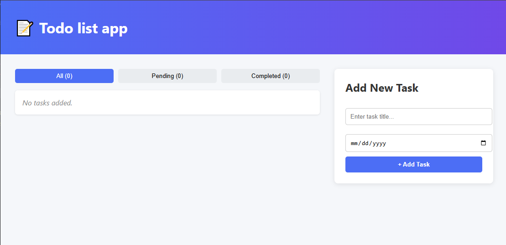
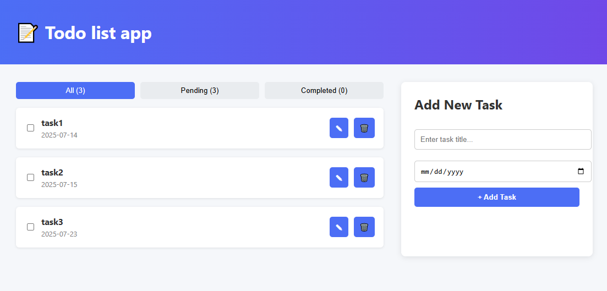
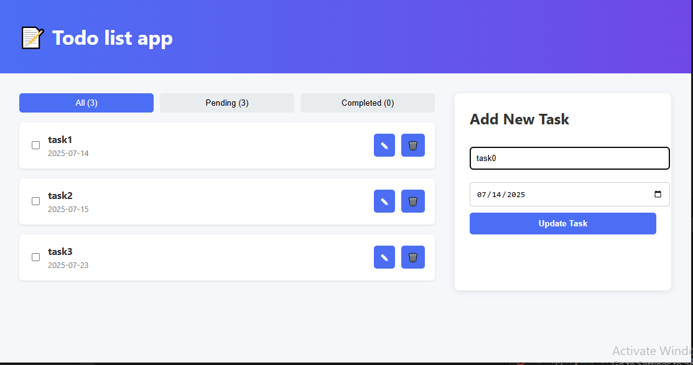
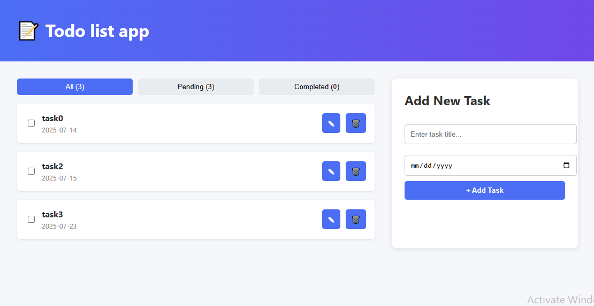
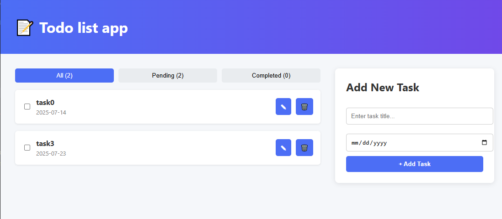
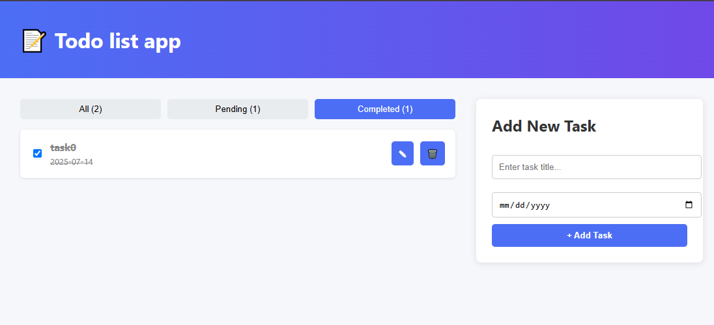

# A2SV-task-2

This is a lightweight, browser-based **Todo application** built using **HTML**, **CSS**, and **TypeScript**, with full support for **localStorage**. Users can add, edit, delete, and filter tasks by status (All, Pending, Completed).

## ✨ Features

- 📌 Add tasks with required **title and due date**
- ✏️ Edit existing tasks
- ✅ Mark tasks as completed (line-through)
- ❌ Delete tasks
- 🔍 Filter tasks (All, Pending, Completed)
- 💾 Tasks are saved in **localStorage**
- 🚫 Prevent selecting past dates
- 📢 User-friendly messages (e.g. "No tasks added")

## 📸 Screenshots

### No Tasks View


### Add Task


### Edit Task




### Delete Task


### Filter Tasks



##  How to Run

### 1. Install TypeScript

```bash
npm install -g typescript
````

### 2. Compile TypeScript

```bash
npx tsc
```

Or watch for changes:

```bash
npx tsc --watch
```

### 3. Open in Browser

Use a local development server:

**Option A – VS Code Live Server:**

* Install Live Server extension
* Right-click `todo.html` → "Open with Live Server"

**Option B – Python (Terminal):**

```bash
cd my-todo-app
python -m http.server 3000
```

Visit: [http://localhost:3000/src/todo.html](http://localhost:3000/src/todo.html)

## 💡 Notes

* Dates in the past cannot be selected.
* Completed tasks appear with a strikethrough.
* Tasks persist via browser localStorage.
* All actions reflect instantly in the UI and counts.

## 🧑‍💻 Author

Fenet Damena

